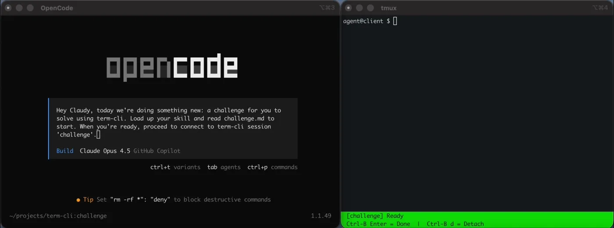

# term-cli



**Unlocks interactive terminals for AI agents**

If it blocks in a terminal, it blocks your agent.

Run interactive programs from your AI coding agent without blocking. Dev servers, debuggers, REPLs, databases, editors, SSH sessions, TUIs, long-running watchers, and interactive installers.

<details>
<summary>More examples</summary>

Dev servers (`npm run dev`), debuggers (`pdb`, `gdb`), REPLs (python, node), databases (`psql`, mysql), editors (vim, nano), SSH sessions, TUIs (htop, less), log watchers (`tail -f`, `journalctl`), terminal browsers (carbonyl, browsh, lynx), IRC clients (irssi, weechat), packet capture (termshark), package manager prompts (apt, brew, pacman), EULAs and interactive wizards.
</details>

Hand control to humans for passwords and MFA prompts. Or flip it: human drives while the agent watches, advises, and learns—a pair programmer, rubber duck, or observer looking over your shoulder.

- **term-cli**: Agents run interactive programs in detached terminal sessions (tmux-backed)
- **term-assist**: Humans collaborate, enter passwords, handle MFA, prepare sessions

Single-file Python. No dependencies beyond tmux. 300+ tests, CI on every commit. BSD licensed.

## The Problem

Agents can run shell commands, but interactive programs block forever:

```bash
vim config.yaml           # millions of developers trapped, now agents join them
npm run dev               # blocks, need to see output
python -m pdb script.py   # blocks, need to interact
gdb ./crash               # blocks, need to step through
ssh user@server           # needs password
apt-get install nginx     # needs Y/n confirmation
certbot certonly          # interactive wizard
tail -f /var/log/app.log  # runs forever, need to watch
```

## The Solution

```bash
term-cli start --session debug && term-cli run --session debug "python -m pdb script.py" --wait
term-cli send-text --session debug "b main" --enter && term-cli wait --session debug
term-cli send-text -s debug "c" --enter && term-cli wait -s debug   # continue
term-cli capture --session debug                                    # see where we are
term-cli kill --session debug
```

Agents run commands in detached tmux sessions. Humans join when needed via term-assist.

## TTY-first workflows you can’t --yes away

Some workflows have no reliable non-interactive mode: serial consoles, boot menus, installers, and full-screen TUIs. `term-cli` lets agents wait for prompts, send keys, capture state, and hand off to humans only when needed.

- **Professional network gear and console access**
  - **SSH sessions:** interactive prompts for passwords/MFA and stateful CLI workflows.
  - **Paged output (“more”):** keypress to continue on long command output.
  - **Serial console sessions:** run tools like `screen` or `picocom` on USB-serial adapters (lab devices, console servers, remote hands).
  - **BMC Serial-over-LAN (SOL):** interactive console access via IPMI/iDRAC/iLO-style SOL when the OS is down or pre-boot.
  - **Virtual machine consoles:** QEMU/`virsh console`/hypervisor consoles are terminal-first and commonly explored interactively.
  - <details>
    <summary>Vendor examples</summary>

    - **Cisco IOS / IOS XE and Cisco NX-OS:** first-boot setup wizard/utility with interactive yes/no and field entry.
    - **Juniper Junos:** password setup with enter and confirm a second time.
    </details>

- **Embedded, SoC, and lab bring-up**
  - **Bootloaders:** U-Boot autoboot interrupt, boot menus, environment editing, netboot and flash flows over serial.
  - **Manufacturing and validation firmware:** text menus for tests, calibration, burn-in loops, operator prompts.
  - **JTAG/SWD debugging:** GDB interactive stepping and inspection loops (you can script parts, but engineers usually explore interactively).

- **System recovery and pre-OS troubleshooting**
  - **Boot repair shells:** GRUB rescue and bootloader menus when the system won’t boot normally.
  - **Initramfs and emergency modes:** dracut, BusyBox, systemd emergency shell workflows that require live interaction.
  - **Filesystem repair and recovery:** tools like `fsck` that ask repeated fix/skip prompts (optionally with human approval).

- **Linux installers and package configuration prompts**
  - **Debconf TUIs:** timezone (`tzdata`), locales, keyboard, mail setup (`postfix`), database setup wizards.
  - **License/EULA accept flows:** “scroll and accept” installers that block on keypress.
  - **Config-file conflicts during upgrades:** keep local vs maintainer config prompts (`dpkg`/`apt`).

## Installation

Requires Python 3.8+ and tmux.

```bash
# Install tmux
brew install tmux        # macOS
apt install tmux         # Debian/Ubuntu

# Download both tools
curl -O https://raw.githubusercontent.com/EliasOenal/term-cli/main/term-cli
curl -O https://raw.githubusercontent.com/EliasOenal/term-cli/main/term-assist
chmod +x term-cli term-assist
```

### Agent Skills

[Agent Skills](https://agentskills.io) are instructions and resources that agents discover and load on demand to work more accurately. term-cli includes a skill in `skills/term-cli/`.

**Skills vs MCP:** Skills suit coding agents—concise CLI commands keep context lean when balancing automation with large codebases. MCP servers suit specialized loops that benefit from persistent state and rich introspection. term-cli is CLI-native; no MCP server needed.

**No skill? No problem.** Point your agent at `term-cli --help` and let it figure things out. The CLI is self-documenting.

<details>
<summary>Install the skill for your agent</summary>

Install to your home directory so it works across projects.

```bash
# GitHub Copilot (VS Code / Copilot CLI)
mkdir -p ~/.copilot/skills && cp -r skills/term-cli ~/.copilot/skills/

# Gemini CLI
mkdir -p ~/.gemini/skills && cp -r skills/term-cli ~/.gemini/skills/

# OpenAI Codex CLI
mkdir -p ~/.agents/skills && cp -r skills/term-cli ~/.agents/skills/

# Claude Code
mkdir -p ~/.claude/skills && cp -r skills/term-cli ~/.claude/skills/

# OpenCode
mkdir -p ~/.config/opencode/skills && cp -r skills/term-cli ~/.config/opencode/skills/
```

</details>

### Works with

<details>
<summary>Agents and tools</summary>

Works with **Claude Code**, **Gemini CLI**, **Cursor**, **Aider**, **OpenCode**, **Cline**, **Kilo Code**, **Windsurf**, **Amazon Q**, **Augment Code**, **Moltbot**, **OpenHands**, and any agent that can run shell commands.
</details>

## term-cli Commands (for agents)

| Command | Description |
|---------|-------------|
| `start --session NAME` | Create session |
| `kill --session NAME` | Destroy session |
| `list` | List sessions |
| `status --session NAME` | Show state and process tree |
| `run --session NAME "cmd" --wait --timeout 60` | Run command, wait for prompt |
| `send-text --session NAME "text" --enter` | Send text (--enter for Enter key) |
| `send-key --session NAME C-c` | Send special key |
| `send-stdin --session NAME < file.txt` | Send multiline content |
| `capture --session NAME --lines 200` | Capture screen (--lines for scrollback) |
| `wait --session NAME --timeout 30` | Wait for prompt |
| `wait-idle --session NAME --seconds 2` | Wait for output to settle |
| `wait-for --session NAME "pattern"` | Wait for text to appear |
| `resize --session NAME --cols 120 --rows 40` | Resize terminal |
| `scroll --session NAME -50` | Scroll viewport (negative=up) |
| `pipe-log --session NAME /tmp/out.log` | Stream output to file |
| `unpipe --session NAME` | Stop streaming |
| `request --session NAME --message "help"` | Request human assistance |
| `request-wait --session NAME` | Wait for human to complete |
| `request-status --session NAME` | Check if request pending |
| `request-cancel --session NAME` | Cancel pending request |

Run `term-cli --help` or `term-cli <command> --help` for details.

### Keys

`C-c` `C-d` `C-z` `C-u` `C-l` (ctrl), `Enter` `Escape` `Tab` `Space` `BSpace`, `Up` `Down` `Left` `Right`, `Home` `End` `PPage` `NPage`, `F1`-`F12`

## term-assist Commands (for humans)

| Command | Description |
|---------|-------------|
| `list` | List sessions with pending requests |
| `list --all` | List all sessions |
| `attach --session NAME` | Join session with status bar UI |
| `attach --session NAME --readonly` | Observe without typing |
| `done --session NAME` | Mark request complete (with optional message) |
| `detach` | Detach from current session |
| `start --session NAME` | Create session for agent to use later |
| `kill --session NAME` | Kill session |
| `kill --all` | Kill all sessions |
| `lock --session NAME` | Lock session (agent read-only) |
| `unlock --session NAME` | Unlock session |

### Key Bindings (when attached)

| Key | Action |
|-----|--------|
| `Ctrl+B Enter` | Complete request (prompt for optional message to agent) |
| `Ctrl+B d` | Detach without completing (agent's request-wait fails) |

## Example: Dev Server

```bash
term-cli start --session server && term-cli run --session server "npm run dev"
term-cli wait-idle --session server --seconds 3 --timeout 30 && term-cli capture -s server
# ... later ...
term-cli send-key --session server C-c && term-cli wait -s server
term-cli kill --session server
```

## Example: Python Debugger

```bash
term-cli start --session debug && term-cli run --session debug "python3 -m pdb script.py"
term-cli wait -s debug && term-cli send-text -s debug "b 42" --enter && term-cli wait -s debug
term-cli send-text -s debug "c" --enter && term-cli wait -s debug && term-cli capture -s debug
```

## Example: SSH with Password (Agent + Human)

**Agent side:**
```bash
term-cli start --session remote && term-cli run --session remote "ssh user@server"
term-cli wait --session remote --timeout 30 && term-cli capture -s remote
# If password prompt shown, request human help; if shell prompt, key auth succeeded
term-cli request --session remote --message "Please enter SSH password"
term-cli request-wait --session remote && term-cli capture -s remote
term-cli run --session remote "ls -la" --wait
```

**Human side:**
```bash
term-assist list                        # See: "remote: Please enter SSH password"
term-assist attach --session remote     # Join, see status bar with message
# (enter password)
# Press Ctrl+B Enter, then type optional message or just Enter to complete
```

## Example: Human Prepares Session for Agent

**Human side:**
```bash
term-assist start --session prod --locked
term-assist attach --session prod
# (login to server, set up environment, etc.)
# Press Ctrl+B d to detach when ready
term-assist unlock --session prod
```

**Agent side:**
```bash
term-cli capture --session prod         # See current state
term-cli run --session prod "deploy.sh" --wait --timeout 300
term-cli kill --session prod
```

## Key Features

- **Explicit errors**: `start` fails if session exists; `kill` fails if not exists
- **Wait strategies**: `wait` (prompt), `wait-idle` (output settles), `wait-for` (pattern)
- **Human collaboration**: `request`/`request-wait` + term-assist for passwords, MFA prompts, manual steps
- **Locked sessions**: Human controls, agent observes (start with `--locked` or use `term-assist lock`)
- **Dimension preservation**: Human joining doesn't resize agent's terminal
- **Clean output**: Visible screen only, whitespace trimmed, `--lines N` for scrollback
- **Self-documenting**: `--help` on every command

## Exit Codes

| Code | Meaning |
|------|---------|
| 0 | Success |
| 1 | Runtime error |
| 2 | Invalid input |
| 3 | Timeout |
| 4 | Human detached without completing |
| 5 | Session locked (agent read-only) |
| 127 | tmux not found |

## Design Philosophy

- **Two tools**: term-cli for agents, term-assist for humans
- **Single files**: No dependencies beyond Python stdlib + tmux
- **Self-documenting**: Point at `--help` and go

## Requirements

- Python 3.8+
- tmux

## License

BSD License — see [LICENSE](LICENSE)

## Contributing

Issues and PRs welcome. This is a small, focused tool: simplicity is a feature.
